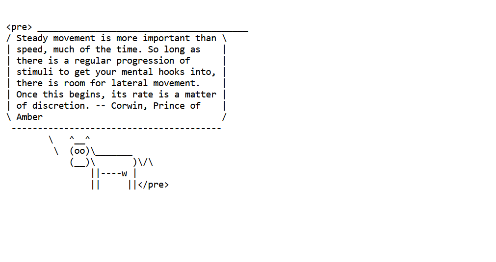

I have successfully containerized the Wisecow application using Docker, deployed it on a Kubernetes cluster with a NodePort service, configured TLS using a self-signed certificate, and set up Nginx ingress for HTTPS routing. All source code, Dockerfile, Kubernetes manifests, and CI/CD workflow are pushed to my GitHub repository. This completes all required objectives of the problem statement.
The above image shows the wisecow application running
